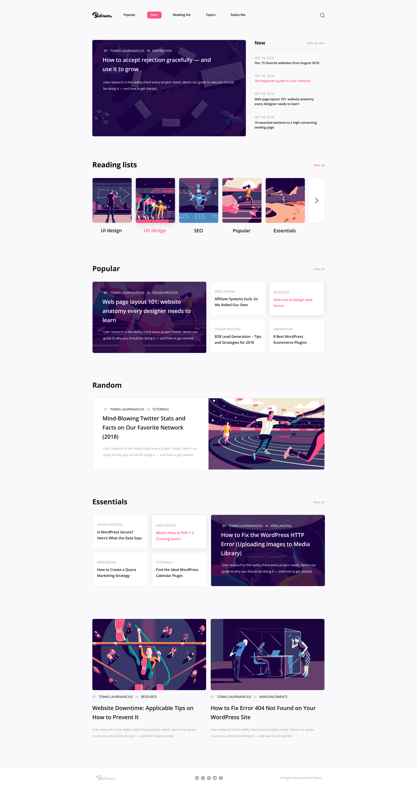

# Blog-Website

## Front-End Project with generated Figma Design using React, Tailwind and Framer

### Credits to Bahram for Figma Design
Link:https://www.figma.com/file/DkQuSqDAlY05sD6kQ00yug/Bahram-l-Free-Blog-UI-Template-(Community)?type=design&node-id=0-2183&mode=design&t=NQ1VeaCuFy0jx4x6-0

## Description

This repository contains a front-end practice project for practicing a font-end project called Bahram. In this project, I had the opportunity to practice my front-end development skills by creating a visually appealing and responsive(later) website and test out the framer-motion library alongwith tailwind.

## Features

- **Animations**: Implemented Animations for Loading Images.

## Technologies Used

- HTML
- Tailwind
- Framer-Motion
- React

## Getting Started

1. Clone this repository to your local machine.
2. Open the project in your preferred code editor.
3. Run `npm i`.
4. Run the website with `npm run dev`.

## Showcase

Here's a screenshot of the CODDI website:

Feel free to fork and expand upon this front-end project to further enhance your skills. Happy coding!

